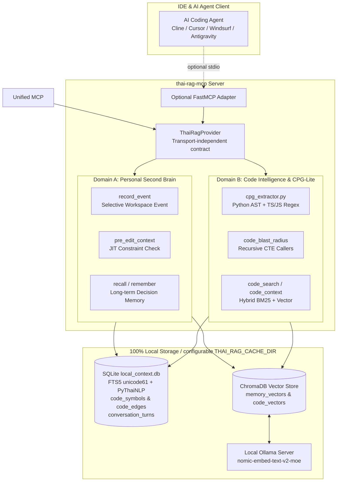

# Thai-RAG Provider and Optional Standalone MCP Adapter (`thai-rag-mcp`)

> **100% Local, Offline-First, Zero-Cost Thai-aware memory, code retrieval, and CPG provider**
> รองรับทั้ง **Personal Second Brain** (ความจำการสนทนาข้ามเซสชัน) และ **Code Property Graph** (วิเคราะห์ความสัมพันธ์ของโค้ดแบบ Multi-Hop AST) สำหรับ IDE และ AI Coding Agents ทุกค่าย

[](https://opensource.org/licenses/MIT)
[](https://www.python.org/downloads/)
[](https://ollama.ai)
[](https://modelcontextprotocol.io)

---

## 📑 สารบัญ (Table of Contents)
1. [สถาปัตยกรรมและหลักการทำงาน (Architecture & Core Principles)](#-สถาปัตยกรรมและหลักการทำงาน-architecture--core-principles)
2. [สารบบเครื่องมือ MCP (Available MCP Tools)](#-สารบบเครื่องมือ-mcp-available-mcp-tools)
3. [คู่มือติดตั้งใน IDE ต่างๆ (IDE Setup Guide)](#-คู่มือติดตั้งใน-ide-ต่างๆ-ide-setup-guide)
   - [Cline / Roo Code (VS Code)](#1-cline--roo-code-vs-code)
   - [Cursor IDE](#2-cursor-ide)
   - [Windsurf / Cascade](#3-windsurf--cascade)
   - [Google Antigravity / Gemini CLI](#4-google-antigravity--gemini-cli)
   - [OpenCode](#5-opencode)
   - [Claude Desktop](#6-claude-desktop)
4. [กฎข้อบังคับสำหรับ AI Agent (Rules & AGENTS.md Directives)](#-กฎข้อบังคับสำหรับ-ai-agent-rules--agentsmd-directives)
   - [กฎเหล็กฉบับเต็ม (ไฟล์ `AGENTS.md`)](AGENTS.md)
5. [การสั่งงานผ่าน CLI (CLI & Background Indexing)](#-การสั่งงานผ่าน-cli-cli--background-indexing)
6. [การแก้ไขปัญหาและประสิทธิภาพ (Troubleshooting & Tips)](#-การแก้ไขปัญหาและประสิทธิภาพ-troubleshooting--tips)

---

## Architecture and Core Principles

Production topology:

```text
Client -> Unified MCP -> Native Thai-RAG Provider
                         └-> optional standalone MCP adapter
```

`thai_rag.provider.ThaiRagProvider` is transport-independent. It exposes versioned capability metadata, explicit `workspace_id` scope, structured status/result/error fields, selective event memory, retrieval/index operations, and health/version metadata. Unified owns public tool names and final presentation. Standalone stdio remains supported for local development and compatibility, but is not authoritative and does not require Unified.

Provider contract returns structured `scope_denied` when canonical workspace ownership/query support is unavailable; storage migration belongs to #2/#13. It never treats category as workspace authorization and never requires raw `remember_turn` for normal operation.

`thai-rag-mcp` ถูกออกแบบมาเพื่อแก้ปัญหาคลาสสิก 3 ประการของ AI Coding Assistants:
1. **AI ลืมบริบทเมื่อขึ้นเซสชันใหม่**: ลืมข้อตกลง สถาปัตยกรรมเดิม หรือคำสั่งห้ามที่เคยคุยไว้
2. **AI แก้โค้ดแล้วทำระบบพัง (Side Effects)**: แก้ฟังก์ชันหนึ่ง แต่ไม่รู้ว่ามีฟังก์ชันอื่นในไฟล์ไหนเรียกใช้อยู่บ้าง
3. **การค้นหาโค้ดภาษาไทยเพี้ยน**: คำค้นหาภาษาไทยไม่มีเว้นวรรค ทำให้ RAG ทั่วไปตัดคำไม่ถูก และคืนค่าผิดพลาด



### 3 เสาหลักของระบบ (The 3 Pillars)

| เสาหลัก | เทคโนโลยีที่ใช้ | ประโยชน์ต่อ AI Agent |
|---|---|---|
| **1. Personal Second Brain** | SQLite FTS5 + PyThaiNLP Tokenization + ChromaDB | บันทึก Event ที่เลือกอย่างชัดเจน เช่น ข้อตกลงหรือการตัดสินใจ และดึงกลับมาได้ใน **0.4 ms** แม้จะปิดโปรแกรมแล้วเปิดใหม่ |
| **2. Code Property Graph (CPG-Lite)** | Python AST + SQLite `WITH RECURSIVE` CTE | วิเคราะห์ความสัมพันธ์ของฟังก์ชัน/คลาสข้ามไฟล์ หา Inbound Callers และคำนวณ Blast Radius ใน **< 1 ms** โดยไม่ต้องพึ่งพา LLM |
| **3. Hybrid Local RAG** | SQLite FTS5 (BM25) + ChromaDB Cosine + RRF | ค้นหาโค้ดและบริบทแบบผสมผสาน ได้ทั้ง Exact Match ของชื่อตัวแปร และความหมายภาษาไทย |

---

## MCP Adapter Compatibility Surface

The stdio adapter exposes legacy-compatible tools for standalone development only. Unified integrations should call `ThaiRagProvider` directly and map `ProviderResult` to public `rag_*` capabilities. `remember_turn` remains legacy compatibility; selective provider memory uses `record_event` with meaningful event types and no mandatory turn ID. `remember_turn` is not an automatic mandatory primitive.

## 🛠️ สารบบเครื่องมือ MCP (Available MCP Tools)

Optional standalone adapter exposes legacy-compatible tools through Model Context Protocol:

| ชื่อเครื่องมือ | พารามิเตอร์ | การทำงานหลัก | จังหวะที่ Agent ต้องเรียก |
|---|---|---|---|
| **`pre_edit_context`** | `file_path` (str)<br>`workspace` (str, opt)<br>`proposed_symbol` (str, opt) | **JIT Pre-Edit Verification**: ดึงข้อตกลงเดิมในอดีต + โค้ดขอบเขตฟังก์ชัน + CPG Blast Radius ที่จะได้รับผลกระทบ | 🔴 **บังคับเรียกทุกครั้งก่อนเริ่มแก้ไขไฟล์ใดๆ** |
| **`remember_turn`** | `role` (str)<br>`content` (str)<br>`workspace` (str, opt)<br>`summary` (str, opt)<br>`tags` (str, opt) | Legacy-compatible raw turn storage for explicit caller-selected conversation turns | ⚪ **ใช้เมื่อ caller ต้องการเก็บ raw turn โดยตั้งใจ; ไม่ใช่ primitive อัตโนมัติที่ต้องเรียกทุกครั้ง** |
| **`code_blast_radius`** | `symbol_name` (str)<br>`workspace` (str, opt)<br>`max_depth` (int, default=2) | วิเคราะห์กราฟ CPG ค้นหาว่ามีฟังก์ชันไหนในไฟล์ใดเรียกใช้สัญลักษณ์นี้บ้าง (Multi-Hop Callers) | 🟡 **เรียกเมื่อวางแผน Refactor หรือลบ/เปลี่ยนชื่อฟังก์ชัน** |
| **`code_search`** | `query` (str)<br>`top_k` (int, default=5)<br>`path_filter` (str, opt) | ค้นหาโค้ดแบบ Hybrid (BM25 + Semantic Vector) รองรับคำค้นหาภาษาไทย | 🟡 **เรียกก่อน grep เพื่อหาตำแหน่งไฟล์และบรรทัดที่เกี่ยวข้อง** |
| **`code_context`** | `file_path` (str)<br>`line_number` (int)<br>`window` (int, default=25) | ดึงขอบเขตของฟังก์ชันหรือคลาสทั้งบล็อกตามเลขบรรทัด | 🟡 **เรียกหลังจากได้ตำแหน่งบรรทัดจาก `code_search`** |
| **`code_index`** | `workspace_path` (str)<br>`workspace_id` (str, required)<br>`force` (bool, default=False)<br>`background` (bool, default=False) | สแกนและดัชนีโค้ดด้วย SHA256 cache พร้อมสกัด CPG AST; `workspace_path` คือ filesystem root ส่วน `workspace_id` คือ logical namespace ที่ stable (เช่น Unified workspace UUID) (`background=True` คืน job_id ทันที) | 🔵 **เรียกเมื่อเปิดโปรเจกต์ใหม่ หรือหลัง git pull ครั้งใหญ่ (workspace ใหญ่ใช้ background)** |
| **`index_status`** | `job_id` (str) | Poll ผล background `code_index` (running/done/error) | 🔵 **เรียก poll หลังสั่ง `code_index(background=True)`** |
| **`remember`** | `content` (str)<br>`category` (str, default="general") | บันทึกความจำถาวรหรือกฎระยะยาวของโปรเจกต์ | 🟢 **บันทึกกฎถาวร เช่น Architecture Decision Records (ADR)** |
| **`recall`** | `query` (str)<br>`category` (str, opt)<br>`limit` (int, default=5) | ค้นหาความจำถาวรด้วย Semantic Vector Search (turn ที่ไม่มี tag หมวดหมู่จะถูกนับเป็น `general` และผ่านทุก category filter) | 🟡 **ค้นหาข้อตกลงในอดีตเกี่ยวกับ Preference หรือ Rules** |
| **`forget`** | `memory_id` (str), `category` (str, optional) | ลบความจำถาวรที่ไม่ต้องการ; เมื่อส่ง `category` จะลบได้เฉพาะ memory ในหมวดนั้น | ⚪ **ใช้เฉพาะเมื่อผู้ใช้สั่งให้ลบอย่างชัดเจนเท่านั้น** |

---

## Optional Standalone IDE Setup

Use direct IDE registration only for standalone development/compatibility. Production clients should register Unified MCP; Unified owns workspace policy and calls native Thai-RAG provider directly.

### สิ่งที่ต้องเตรียมก่อนติดตั้ง (Prerequisites)
1. **Ollama**: รันโมเดล Embedding บนเครื่อง (ทำงาน Offline 100%):
   ```bash
   ollama pull nomic-embed-text-v2-moe
   ```
2. **Python 3.10+ และติดตั้งแพ็กเกจจาก repository**:
   ```bash
   python -m venv .venv
   source .venv/bin/activate
   python -m pip install --upgrade pip
   python -m pip install -e .
   ```
   หลังติดตั้งจะมีคำสั่ง `thai-rag-mcp` ใน environment โดยไม่ต้องอ้าง path ของ repository หรือไฟล์ entrypoint โดยตรง

   ถ้าต้องการ Floating HUD ให้ติดตั้ง extra:
   ```bash
   python -m pip install -e ".[hud]"
   ```

3. **ที่เก็บข้อมูล** (ไม่บังคับ): ค่าเริ่มต้นคือ `~/.cache/thai-rag-mcp` และเปลี่ยนได้ด้วย `THAI_RAG_CACHE_DIR`
   ```bash
   export THAI_RAG_CACHE_DIR="/path/to/thai-rag-cache"
   ```

---

### 1. Cline / Roo Code (VS Code)

แก้ไขไฟล์ `cline_mcp_settings.json` (เปิดผ่านคำสั่ง `Preferences: Open User Settings (JSON)` หรือไอคอนฟันเฟืองของ Cline):
- **Linux Path**: `~/.config/Code/User/globalStorage/saoudrizwan.claude-dev/settings/cline_mcp_settings.json`

```json
{
  "mcpServers": {
    "thai-rag-mcp": {
      "command": "thai-rag-mcp",
      "args": [],
      "disabled": false,
      "autoApprove": [
        "remember",
        "recall",
        "remember_turn",
        "pre_edit_context",
        "code_blast_radius",
        "code_search",
        "code_context",
        "code_index",
        "index_status"
      ]
    }
  }
}
```

---

### 2. Cursor IDE

ใน Cursor ให้ไปที่ **Settings** -> **Features** -> **MCP** -> **Add New MCP Server**  
หรือสร้างไฟล์ `.cursor/mcp.json` ไว้ในโฟลเดอร์โปรเจกต์ของคุณ:

```json
{
  "mcpServers": {
    "thai-rag-mcp": {
      "command": "thai-rag-mcp",
      "args": []
    }
  }
}
```

---

### 3. Windsurf / Cascade

แก้ไขไฟล์คอนฟิก MCP ของ Windsurf:
- **Linux Path**: `~/.codeium/windsurf/mcp_config.json`

```json
{
  "mcpServers": {
    "thai-rag-mcp": {
      "command": "thai-rag-mcp",
      "args": []
    }
  }
}
```

---

### 4. Google Antigravity / Gemini CLI

แก้ไขไฟล์ `~/.gemini/config/mcp_config.json`:

```json
{
  "mcpServers": {
    "thai-rag-mcp": {
      "command": "thai-rag-mcp",
      "args": []
    }
  }
}
```

พร้อมเพิ่ม Permission อนุมัติอัตโนมัติใน `~/.gemini/config/config.json`:
```json
"auto_approved_tools": [
  "mcp(thai-rag-mcp/remember)",
  "mcp(thai-rag-mcp/recall)",
  "mcp(thai-rag-mcp/remember_turn)",
  "mcp(thai-rag-mcp/pre_edit_context)",
  "mcp(thai-rag-mcp/code_blast_radius)",
  "mcp(thai-rag-mcp/code_index)",
  "mcp(thai-rag-mcp/code_search)",
  "mcp(thai-rag-mcp/code_context)"
]
```

---

### 5. OpenCode

แก้ไขไฟล์ `~/.config/opencode/opencode.jsonc`:

```jsonc
{
  "mcp": {
    "thai-rag-mcp": {
      "type": "stdio",
      "command": "thai-rag-mcp",
      "args": []
    }
  }
}
```

---

### 6. Claude Desktop

แก้ไขไฟล์คอนฟิกของ Claude Desktop:
- **Linux Path**: `~/.config/Claude/claude_desktop_config.json`
- **macOS Path**: `~/Library/Application Support/Claude/claude_desktop_config.json`

```json
{
  "mcpServers": {
    "thai-rag-mcp": {
      "command": "thai-rag-mcp",
      "args": []
    }
  }
}
```

---

## 📦 การติดตั้ง การทดสอบ และ Dependency Policy

### Standalone MCP

หลัง `pip install -e .` หรือการติดตั้งแพ็กเกจแบบปกติ สามารถเริ่ม stdio MCP ได้โดยตรง:

```bash
thai-rag-mcp --stdio
```

การรัน `thai-rag-mcp` โดยไม่มี argument ใช้ stdio เช่นเดียวกัน ส่วนไฟล์ `thai_rag_context_mcp.py` ยังคงเป็น compatibility wrapper สำหรับผู้ใช้เดิม

### Test profiles

ติดตั้ง dependency สำหรับทดสอบก่อน:

```bash
python -m pip install -e ".[test]"
```

Default suite เป็น **hermetic/unit profile**: ไม่เรียก network, ไม่ต้องมี Ollama และใช้ temporary SQLite/Chroma เท่านั้น

```bash
python -m pytest
```

งานที่ต้องพึ่ง environment ภายนอกแยกเป็น opt-in markers:

```bash
python -m pytest -m integration   # ต้อง provision Ollama/local integration service เอง
python -m pytest -m stress        # stress/session harness
python -m pytest -m benchmark     # quality/performance/migration benchmark
```

Test doubles สำหรับ embeddings เป็น deterministic, non-zero และกำหนด dimension ได้ เพื่อไม่ผูก unit tests เข้ากับ model/vector dimension เดียว

### Permanent CI quality gate

ทุก Pull Request เข้า `main` และทุก push เข้า `main` จะรัน GitHub Actions workflow `.github/workflows/ci.yml` โดยมี check names ที่ตั้งใจให้ใช้กับ branch protection ได้ภายหลัง:

- `unit-py3.10` ถึง `unit-py3.14`: clean install + compile smoke + hermetic unit suite
- `package-smoke`: build wheel, fresh-venv install, CLI/import และ standalone stdio startup
- `schema-regression`: storage/workspace migration regression suite
- `repository-hygiene`: ป้องกัน DB/cache/socket/build artifacts ถูก commit

Live Ollama, stress และ benchmark profiles ยังคงเป็น opt-in และไม่ block normal CI

### Dependency update policy

Runtime dependencies ถูกประกาศใน `pyproject.toml` ด้วยช่วงเวอร์ชันที่จำกัด major version เพื่อหลีกเลี่ยงการ float ข้าม storage/protocol incompatibility โดยไม่ตั้งใจ การขยับ major version ให้ทำผ่าน PR แยก พร้อมรัน hermetic suite และ integration ที่เกี่ยวข้องก่อน merge

`hud` เป็น optional extra เพื่อให้ provider/standalone core ไม่บังคับติดตั้ง Pillow/pystray หากไม่ได้ใช้ UI

---

## 📜 กฎข้อบังคับสำหรับ AI Agent (Rules & AGENTS.md Directives)

เพื่อให้ AI Model ใน IDE เรียกใช้เครื่องมือได้อย่างถูกต้อง ไม่ข้ามขั้นตอน และทำงานได้เต็มประสิทธิภาพ **กฎเหล็กทั้งหมดถูกเก็บไว้ในไฟล์ [`AGENTS.md`](AGENTS.md) ที่ root ของโปรเจกต์** — โปรดอ่านและปฏิบัติตามไฟล์นี้เสมอ

- IDE ที่รองรับ `AGENTS.md` (Cline, Cursor, Codex, Claude Code ฯลฯ) จะอ่านกฎจากไฟล์นี้โดยอัตโนมัติ
- หาก IDE ของคุณใช้ไฟล์ Rules แยก (`.clinerules`, `.cursorrules`, `.windsurfrules`) ให้คัดลอกเนื้อหาจาก [`AGENTS.md`](AGENTS.md) ไปวางในไฟล์นั้นแทน

### กฎเหล็กสรุปสั้น ๆ (ฉบับเต็มอยู่ที่ [`AGENTS.md`](AGENTS.md))

1. **JIT Pre-Edit Verification** — เรียก `pre_edit_context(file_path, proposed_symbol?)` ก่อนแก้ไขไฟล์ใดๆ เสมอ เพื่อดูข้อตกลงเดิม โค้ดขอบเขต และ CPG Blast Radius
2. **Selective Conversational Memory** — ใช้ `record_event(event_type, content, workspace_id, summary, tags)` สำหรับข้อกำหนดหรือการตัดสินใจที่เลือกเก็บอย่างชัดเจน; ใช้ `remember_turn` เฉพาะเมื่อ caller ต้องการ raw turn โดยตั้งใจ ไม่ใช่ automatic mandatory primitive
3. **Retrieval-First Coding** — ใช้ `code_search` → `code_context` ก่อน grep/อ่านไฟล์ทั้งไฟล์ และเรียก `code_blast_radius` เมื่อต้อง Refactor หรือเปลี่ยน Signature
4. **ห้ามบอกว่า "จำไม่ได้"** — เมื่อผู้ใช้ถามถึงงานเดิมหรือการตัดสินใจในอดีต ต้องเรียก `recall` หรือ `pre_edit_context` ก่อนตอบ ห้ามเดาเอาเอง

---

### ตัวอย่าง Flow การทำงานจริงของ Agent (Expected Agent Behavior)

#### ตัวอย่าง: ก่อนจะทำการแก้ไขฟังก์ชันใน `storage.py`
```
[User]: "ช่วยแก้ฟังก์ชัน save_conversation_turn ใน storage.py ให้รองรับ multi-tagging หน่อย"

[AI Agent Steps]:
1. เรียก: pre_edit_context(file_path="thai_rag/storage.py", proposed_symbol="save_conversation_turn")
   -> ได้รับผลลัพธ์:
      - พบข้อจำกัดเดิม: "ต้องใช้ PyThaiNLP ตัดคำก่อนบันทึกลง FTS5 เสมอ"
      - พบ CPG Blast Radius: มี 9 callers เรียกใช้อยู่ (รวมถึง server.py:remember_turn)
2. เรียก: code_context(file_path="thai_rag/storage.py", line_number=355)
   -> เห็นเนื้อหาฟังก์ชันแบบสมบูรณ์
3. ทำการแก้ไขโค้ดโดยไม่ละเมิดข้อจำกัดเดิม และไม่กระทบ caller ทั้ง 9 จุด
4. หากเป็นข้อกำหนดหรือการตัดสินใจที่ควรจำ เรียก: record_event(event_type="decision", content="Updated save_conversation_turn to support multi-tagging while preserving PyThaiNLP tokenization", workspace_id="stable-project-id", tags="storage,cpg")
   `remember_turn` ใช้เฉพาะเมื่อ caller ต้องการเก็บ raw turn โดยตั้งใจ ไม่ใช่ขั้นตอนบังคับของทุก turn
```

---

## ⚡ การสั่งงานผ่าน CLI (CLI & Background Indexing)

นอกเหนือจากการเรียกผ่าน IDE คุณยังสามารถสั่งดัชนีโค้ดผ่าน Terminal ได้โดยตรง:

### 1. ดัชนีโปรเจกต์ใหม่ (Incremental Indexing with SHA256 Cache)
```bash
thai-rag-mcp --index "/path/to/project"
```
- ระบบจะเปิดหน้าต่าง **Floating HUD** ลอยขึ้นมามุมจออัตโนมัติ แสดง Progress Bar, จำนวนคิว และ EWMA ETA
- ไฟล์ที่ไม่มีการเปลี่ยนแปลงจะถูกข้ามผ่าน SHA256 cache ในเวลาไม่กี่มิลลิวินาที
- เมื่อเสร็จสิ้น หน้าต่าง HUD จะปิดตัวลงอัตโนมัติ 100% ปราศจาก zombie process

### 2. บังคับดัชนีใหม่ทั้งหมด (Force Re-index)
```bash
thai-rag-mcp --index "/path/to/project" --force
```

### 2b. ดัชนี workspace ใหญ่แบบ Background (ไม่บล็อก Agent)
เรียกผ่าน MCP tool แทน CLI sync (workspace ใหญ่ embed ผ่าน Ollama นาน ~60s+):
```
code_index(workspace_path="/path/to/project", workspace="stable-project-id", background=True)
-> 🚀 Indexing started in background [Job: idx_xxxxxxxx] ... Poll with `index_status("idx_xxxxxxxx")`.

index_status(job_id="idx_xxxxxxxx")
-> ⏳ still running ... / ✅ complete (indexed/skipped/duration) / ❌ failed: <error>
```
- Job อยู่ใน memory ของ MCP process เดียว (restart server แล้วหาย — รัน `code_index` ใหม่ได้เพราะ incremental cache)
- Floating HUD ยังแสดง progress ตามเดิมผ่าน `ProgressReporter`
- `workspace_path` เป็น root จริงที่ใช้เดินไฟล์และถูก canonicalize ด้วย `Path.resolve()` ส่วน `workspace` เป็น namespace เชิงตรรกะสำหรับ path, FTS, vectors และ CPG
- `workspace_id` ต้องส่งเป็น stable logical namespace เมื่อเรียก `code_index`; ระบบจะไม่อนุมาน namespace จาก filesystem path

### 3. ดูดประวัติแชตย้อนหลังเข้าสู่ Memory (Historical Chat Ingestion)
```bash
python scripts/ingest_history.py
```
- ดูด Log ทั้งหมดจาก `~/.cline/data/memory/knowledge-graph.jsonl` และ Antigravity Transcripts เข้าสู่ฐานข้อมูล SQLite FTS5 และ ChromaDB อัตโนมัติ

### 4. รัน Real-Session E2E Stress & Smoke Benchmark
```bash
python scripts/e2e_stress_session_test.py
```

---

## 🔧 การแก้ไขปัญหาและประสิทธิภาพ (Troubleshooting & Tips)

| ปัญหาที่อาจพบ | สาเหตุ | วิธีแก้ไข |
|---|---|---|
| **Ollama Unreachable Error** | Service Ollama ยังไม่ได้ถูกรัน | เปิด Terminal แล้วพิมพ์ `ollama serve` หรือตรวจสอบว่ารันพอร์ต `11434` อยู่หรือไม่ |
| **Model Not Found Error** | ยังไม่ได้ดาวน์โหลดโมเดล Embedding | พิมพ์คำสั่ง `ollama pull nomic-embed-text-v2-moe` |
| **ค้นหาภาษาไทยไม่เจอ** | ลืมตัดคำภาษาไทย | ระบบเวอร์ชันล่าสุดมี `pythainlp.tokenize.word_tokenize(..., engine="newmm")` ตัดคำลง FTS5 อัตโนมัติ |
| **เนื้อที่ดิสก์ Root `/` เต็ม** | แคชขนาดใหญ่กินเนื้อที่ระบบ | ตั้ง `THAI_RAG_CACHE_DIR` ไปยัง volume ที่มีพื้นที่เพียงพอ แล้ว restart server; ไม่ต้องใช้ symlink หรือ path เฉพาะเครื่อง |
| **Git Permission บน NTFS mount** | ไฟล์บน NTFS mount ถูกเซ็ตโหมด 755 อัตโนมัติ | รันคำสั่ง `git config core.fileMode false` ภายในโฟลเดอร์โปรเจกต์ |

---

## 📜 License
พัฒนาภายใต้สัญญาอนุญาต **MIT License** — ใช้งาน ดัดแปลง และแจกจ่ายได้อย่างเสรี 100% Offline & Privacy-Preserved.
