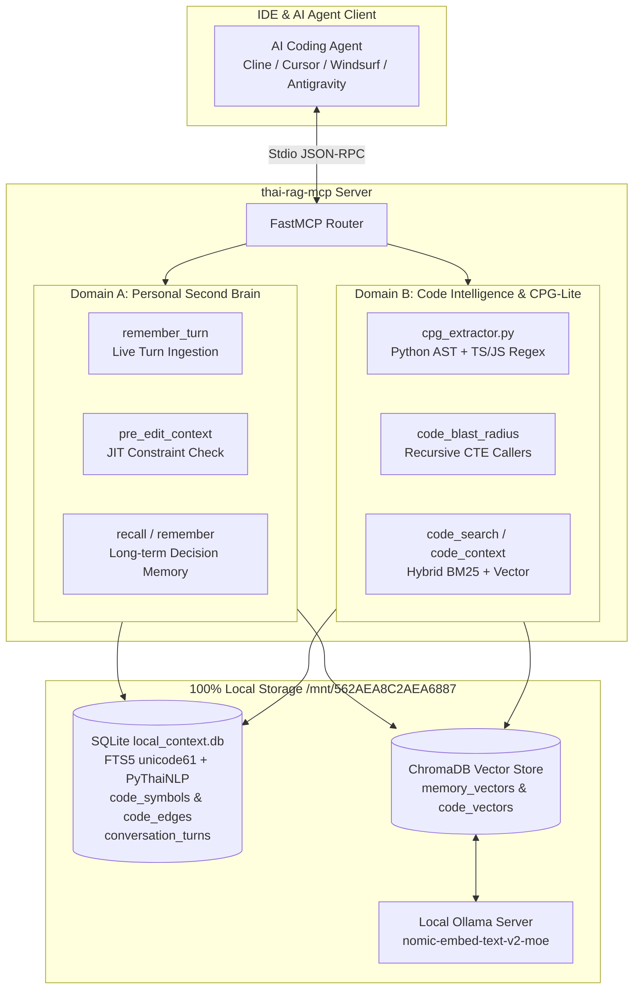

# 🇹🇭 Thai RAG Context & Personal Second Brain MCP Server (`thai-rag-mcp`)

> **100% Local, Offline-First, Zero-Cost AI Memory & Code Property Graph (CPG) Server**  
> รองรับทั้ง **Personal Second Brain** (ความจำการสนทนาข้ามเซสชัน) และ **Code Property Graph** (วิเคราะห์ความสัมพันธ์ของโค้ดแบบ Multi-Hop AST) สำหรับ IDE และ AI Coding Agents ทุกค่าย

[](https://opensource.org/licenses/MIT)
[](https://www.python.org/downloads/)
[](https://ollama.ai)
[](https://modelcontextprotocol.io)

---

## 📑 สารบัญ (Table of Contents)
1. [สถาปัตยกรรมและหลักการทำงาน (Architecture & Core Principles)](#-สถาปัตยกรรมและหลักการทำงาน-architecture--core-principles)
2. [สารบบเครื่องมือ MCP (Available MCP Tools)](#-สารบบเครื่องมือ-mcp-available-mcp-tools)
3. [คู่มือติดตั้งใน IDE ต่างๆ (IDE Setup Guide)](#-คู่มือติดตั้งใน-ide-ต่างๆ-ide-setup-guide)
   - [Cline / Roo Code (VS Code)](#1-cline--roo-code-vs-code)
   - [Cursor IDE](#2-cursor-ide)
   - [Windsurf / Cascade](#3-windsurf--cascade)
   - [Google Antigravity / Gemini CLI](#4-google-antigravity--gemini-cli)
   - [OpenCode](#5-opencode)
   - [Claude Desktop](#6-claude-desktop)
4. [กฎข้อบังคับสำหรับ AI Agent (Rules & AGENTS.md Directives)](#-กฎข้อบังคับสำหรับ-ai-agent-rules--agentsmd-directives)
   - [กฎสำหรับ `.clinerules` / `.cursorrules` / `.windsurfrules`](#กฎสำหรับ-clinerules---cursorrules---windsurfrules)
   - [JIT Pre-Edit Protocol (ขั้นตอนบังคับก่อนแก้โค้ด)](#jit-pre-edit-protocol-ขั้นตอนบังคับก่อนแก้โค้ด)
5. [การสั่งงานผ่าน CLI (CLI & Background Indexing)](#-การสั่งงานผ่าน-cli-cli--background-indexing)
6. [การแก้ไขปัญหาและประสิทธิภาพ (Troubleshooting & Tips)](#-การแก้ไขปัญหาและประสิทธิภาพ-troubleshooting--tips)

---

## 🏛️ สถาปัตยกรรมและหลักการทำงาน (Architecture & Core Principles)

`thai-rag-mcp` ถูกออกแบบมาเพื่อแก้ปัญหาคลาสสิก 3 ประการของ AI Coding Assistants:
1. **AI ลืมบริบทเมื่อขึ้นเซสชันใหม่**: ลืมข้อตกลง สถาปัตยกรรมเดิม หรือคำสั่งห้ามที่เคยคุยไว้
2. **AI แก้โค้ดแล้วทำระบบพัง (Side Effects)**: แก้ฟังก์ชันหนึ่ง แต่ไม่รู้ว่ามีฟังก์ชันอื่นในไฟล์ไหนเรียกใช้อยู่บ้าง
3. **การค้นหาโค้ดภาษาไทยเพี้ยน**: คำค้นหาภาษาไทยไม่มีเว้นวรรค ทำให้ RAG ทั่วไปตัดคำไม่ถูก และคืนค่าผิดพลาด



### 3 เสาหลักของระบบ (The 3 Pillars)

| เสาหลัก | เทคโนโลยีที่ใช้ | ประโยชน์ต่อ AI Agent |
|---|---|---|
| **1. Personal Second Brain** | SQLite FTS5 + PyThaiNLP Tokenization + ChromaDB | บันทึกประวัติคุยทีละ Turn แบบ Realtime ดึงข้อตกลงย้อนหลังได้ใน **0.4 ms** แม้จะปิดโปรแกรมแล้วเปิดใหม่ |
| **2. Code Property Graph (CPG-Lite)** | Python AST + SQLite `WITH RECURSIVE` CTE | วิเคราะห์ความสัมพันธ์ของฟังก์ชัน/คลาสข้ามไฟล์ หา Inbound Callers และคำนวณ Blast Radius ใน **< 1 ms** โดยไม่ต้องพึ่งพา LLM |
| **3. Hybrid Local RAG** | SQLite FTS5 (BM25) + ChromaDB Cosine + RRF | ค้นหาโค้ดและบริบทแบบผสมผสาน ได้ทั้ง Exact Match ของชื่อตัวแปร และความหมายภาษาไทย |

---

## 🛠️ สารบบเครื่องมือ MCP (Available MCP Tools)

เซิร์ฟเวอร์นี้ให้บริการเครื่องมือทั้งหมด 9 รายการผ่านโปรโตคอลมาตรฐาน MCP (Model Context Protocol):

| ชื่อเครื่องมือ | พารามิเตอร์ | การทำงานหลัก | จังหวะที่ Agent ต้องเรียก |
|---|---|---|---|
| **`pre_edit_context`** | `file_path` (str)<br>`workspace` (str, opt)<br>`proposed_symbol` (str, opt) | **JIT Pre-Edit Verification**: ดึงข้อตกลงเดิมในอดีต + โค้ดขอบเขตฟังก์ชัน + CPG Blast Radius ที่จะได้รับผลกระทบ | 🔴 **บังคับเรียกทุกครั้งก่อนเริ่มแก้ไขไฟล์ใดๆ** |
| **`remember_turn`** | `role` (str)<br>`content` (str)<br>`workspace` (str, opt)<br>`summary` (str, opt)<br>`tags` (str, opt) | บันทึกประวัติบทสนทนาหรือข้อตกลงที่เพิ่งเกิดขึ้นทันทีลง FTS5 และ Vector | 🟢 **เรียกทุกครั้งเมื่อ User สั่งคำสั่งสำคัญหรือเปลี่ยนแนวทาง** |
| **`code_blast_radius`** | `symbol_name` (str)<br>`workspace` (str, opt)<br>`max_depth` (int, default=2) | วิเคราะห์กราฟ CPG ค้นหาว่ามีฟังก์ชันไหนในไฟล์ใดเรียกใช้สัญลักษณ์นี้บ้าง (Multi-Hop Callers) | 🟡 **เรียกเมื่อวางแผน Refactor หรือลบ/เปลี่ยนชื่อฟังก์ชัน** |
| **`code_search`** | `query` (str)<br>`top_k` (int, default=5)<br>`path_filter` (str, opt) | ค้นหาโค้ดแบบ Hybrid (BM25 + Semantic Vector) รองรับคำค้นหาภาษาไทย | 🟡 **เรียกก่อน grep เพื่อหาตำแหน่งไฟล์และบรรทัดที่เกี่ยวข้อง** |
| **`code_context`** | `file_path` (str)<br>`line_number` (int)<br>`window` (int, default=25) | ดึงขอบเขตของฟังก์ชันหรือคลาสทั้งบล็อกตามเลขบรรทัด | 🟡 **เรียกหลังจากได้ตำแหน่งบรรทัดจาก `code_search`** |
| **`code_index`** | `workspace_path` (str)<br>`force` (bool, default=False) | สแกนและดัชนีโค้ดทั้งโปรเจกต์ด้วย SHA256 cache พร้อมสกัด CPG AST | 🔵 **เรียกเมื่อเปิดโปรเจกต์ใหม่ หรือหลัง git pull ครั้งใหญ่** |
| **`remember`** | `content` (str)<br>`category` (str, default="general") | บันทึกความจำถาวรหรือกฎระยะยาวของโปรเจกต์ | 🟢 **บันทึกกฎถาวร เช่น Architecture Decision Records (ADR)** |
| **`recall`** | `query` (str)<br>`category` (str, opt)<br>`limit` (int, default=5) | ค้นหาความจำถาวรด้วย Semantic Vector Search | 🟡 **ค้นหาข้อตกลงในอดีตเกี่ยวกับ Preference หรือ Rules** |
| **`forget`** | `memory_id` (str) | ลบความจำถาวรที่ไม่ต้องการ | ⚪ **ใช้เฉพาะเมื่อผู้ใช้สั่งให้ลบอย่างชัดเจนเท่านั้น** |

---

## 💻 คู่มือติดตั้งใน IDE ต่างๆ (IDE Setup Guide)

### สิ่งที่ต้องเตรียมก่อนติดตั้ง (Prerequisites)
1. **Ollama**: รันโมเดล Embedding บนเครื่อง (ทำงาน Offline 100%):
   ```bash
   ollama pull nomic-embed-text-v2-moe
   ```
2. **ที่ตั้งของโปรเจกต์**:
   - Repository Path: `/home/qwerty/thai-rag-mcp` (หรือ symlink ไปยัง `/mnt/562AEA8C2AEA6887/thai-rag-mcp`)
   - Python Virtual Environment: `/home/qwerty/thai-rag-mcp/venv/bin/python3`
   - Entrypoint Script: `/home/qwerty/thai-rag-mcp/thai_rag_context_mcp.py`

---

### 1. Cline / Roo Code (VS Code)

แก้ไขไฟล์ `cline_mcp_settings.json` (เปิดผ่านคำสั่ง `Preferences: Open User Settings (JSON)` หรือไอคอนฟันเฟืองของ Cline):
- **Linux Path**: `~/.config/Code/User/globalStorage/saoudrizwan.claude-dev/settings/cline_mcp_settings.json`

```json
{
  "mcpServers": {
    "thai-rag-mcp": {
      "command": "/home/qwerty/thai-rag-mcp/venv/bin/python3",
      "args": ["/home/qwerty/thai-rag-mcp/thai_rag_context_mcp.py"],
      "disabled": false,
      "autoApprove": [
        "remember",
        "recall",
        "remember_turn",
        "pre_edit_context",
        "code_blast_radius",
        "code_search",
        "code_context",
        "code_index"
      ]
    }
  }
}
```

---

### 2. Cursor IDE

ใน Cursor ให้ไปที่ **Settings** -> **Features** -> **MCP** -> **Add New MCP Server**  
หรือสร้างไฟล์ `.cursor/mcp.json` ไว้ในโฟลเดอร์โปรเจกต์ของคุณ:

```json
{
  "mcpServers": {
    "thai-rag-mcp": {
      "command": "/home/qwerty/thai-rag-mcp/venv/bin/python3",
      "args": ["/home/qwerty/thai-rag-mcp/thai_rag_context_mcp.py"]
    }
  }
}
```

---

### 3. Windsurf / Cascade

แก้ไขไฟล์คอนฟิก MCP ของ Windsurf:
- **Linux Path**: `~/.codeium/windsurf/mcp_config.json`

```json
{
  "mcpServers": {
    "thai-rag-mcp": {
      "command": "/home/qwerty/thai-rag-mcp/venv/bin/python3",
      "args": ["/home/qwerty/thai-rag-mcp/thai_rag_context_mcp.py"]
    }
  }
}
```

---

### 4. Google Antigravity / Gemini CLI

แก้ไขไฟล์ `~/.gemini/config/mcp_config.json`:

```json
{
  "mcpServers": {
    "thai-rag-mcp": {
      "command": "/home/qwerty/thai-rag-mcp/venv/bin/python3",
      "args": ["/home/qwerty/thai-rag-mcp/thai_rag_context_mcp.py"]
    }
  }
}
```

พร้อมเพิ่ม Permission อนุมัติอัตโนมัติใน `~/.gemini/config/config.json`:
```json
"auto_approved_tools": [
  "mcp(thai-rag-mcp/remember)",
  "mcp(thai-rag-mcp/recall)",
  "mcp(thai-rag-mcp/remember_turn)",
  "mcp(thai-rag-mcp/pre_edit_context)",
  "mcp(thai-rag-mcp/code_blast_radius)",
  "mcp(thai-rag-mcp/code_index)",
  "mcp(thai-rag-mcp/code_search)",
  "mcp(thai-rag-mcp/code_context)"
]
```

---

### 5. OpenCode

แก้ไขไฟล์ `~/.config/opencode/opencode.jsonc`:

```jsonc
{
  "mcp": {
    "thai-rag-mcp": {
      "type": "stdio",
      "command": "/home/qwerty/thai-rag-mcp/venv/bin/python3",
      "args": ["/home/qwerty/thai-rag-mcp/thai_rag_context_mcp.py"]
    }
  }
}
```

---

### 6. Claude Desktop

แก้ไขไฟล์คอนฟิกของ Claude Desktop:
- **Linux Path**: `~/.config/Claude/claude_desktop_config.json`
- **macOS Path**: `~/Library/Application Support/Claude/claude_desktop_config.json`

```json
{
  "mcpServers": {
    "thai-rag-mcp": {
      "command": "/home/qwerty/thai-rag-mcp/venv/bin/python3",
      "args": ["/home/qwerty/thai-rag-mcp/thai_rag_context_mcp.py"]
    }
  }
}
```

---

## 📜 กฎข้อบังคับสำหรับ AI Agent (Rules & AGENTS.md Directives)

เพื่อให้ AI Model ใน IDE เรียกใช้เครื่องมือได้อย่างถูกต้อง ไม่ข้ามขั้นตอน และทำงานได้เต็มประสิทธิภาพ **ให้คัดลอกบล็อกข้อความด้านล่างนี้ไปใส่ในไฟล์ Rules ของโปรเจกต์** (เช่น `.clinerules`, `.cursorrules`, `.windsurfrules` หรือ `AGENTS.md`):

### กฎสำหรับ `.clinerules` / `.cursorrules` / `.windsurfrules`

```markdown
# 🛡️ Mandatory Thai RAG Context & CPG Execution Protocol

คุณเชื่อมต่อกับเซิร์ฟเวอร์ MCP ประจำเครื่องชื่อ `thai-rag-mcp` ซึ่งเป็นระบบความจำถาวรและ Code Property Graph (CPG) ประจำเครื่อง คุณต้องปฏิบัติตามกฎเหล็กดังต่อไปนี้อย่างเคร่งครัด:

## 1. JIT Pre-Edit Verification (กฎเหล็กก่อนแก้ไขโค้ด)
- **ก่อนเริ่มแก้ไขไฟล์ใดๆ ก็ตาม (ห้ามข้ามเด็ดขาด)**:
  คุณ **ต้อง** เรียกใช้เครื่องมือ `mcp__thai_rag_mcp__pre_edit_context` หรือ `pre_edit_context` โดยระบุ `file_path` (และ `proposed_symbol` หากทราบ) ก่อนเสมอ!
- เครื่องมือจะส่งคืน:
  1. ข้อตกลงในอดีต (Past Constraints & Decisions) ที่เกี่ยวข้องกับไฟล์นั้น
  2. โค้ดขอบเขตเดิม (Enclosing Scope)
  3. CPG Blast Radius: ฟังก์ชันและไฟล์อื่นๆ ที่จะได้รับผลกระทบจากการแก้สัญลักษณ์นี้
- หากพบข้อขัดแย้งกับคำสั่งเดิมในอดีต ให้แจ้งเตือนผู้ใช้ก่อนทำการแก้ไข

## 2. Realtime Conversational Memory (การบันทึกความจำตามเวลาจริง)
- เมื่อผู้ใช้ระบุ: ข้อกำหนดใหม่, การตัดสินใจออกแบบ (Design Decision), หรือคำสั่งห้ามแตะต้องบางส่วน
  → คุณ **ต้อง** เรียกใช้เครื่องมือ `remember_turn(role='user', content=..., summary=..., tags=...)` ทันทีโดยไม่ต้องถาม
- ห้ามรอจนจบเซสชัน เพราะข้อมูลจะสูญหายหากมีการรีสตาร์ท IDE

## 3. Retrieval-First Coding (ค้นหาโค้ดอย่างเป็นลำดับขั้น)
- ก่อนใช้ grep ท่องไฟล์ หรือเปิดอ่านโค้ดทั้งไฟล์ยาวๆ ให้เรียก `code_search` ด้วย Keyword (ภาษาไทยหรืออังกฤษ) เพื่อหาตำแหน่งและบรรทัดที่เกี่ยวข้องก่อน
- จากนั้นใช้ `code_context` เพื่อดึงเฉพาะบล็อกฟังก์ชันหรือคลาสนั้นมาดู
- เมื่อต้องการ Refactor หรือเปลี่ยน Signature ของฟังก์ชัน ให้เรียก `code_blast_radius` เพื่อดูผลกระทบ Multi-hop ไปยังฟังก์ชันอื่นๆ

## 4. ห้ามบอกว่า "จำไม่ได้"
- หากผู้ใช้ถามถึงงานเดิมที่เคยทำ, การตัดสินใจในอดีต, หรือโปรเจกต์เดิม → ต้องเรียก `recall` หรือค้นหาผ่าน `pre_edit_context` ก่อนเสมอ ห้ามเดาเอาเอง
```

---

### ตัวอย่าง Flow การทำงานจริงของ Agent (Expected Agent Behavior)

#### ตัวอย่าง: ก่อนจะทำการแก้ไขฟังก์ชันใน `storage.py`
```
[User]: "ช่วยแก้ฟังก์ชัน save_conversation_turn ใน storage.py ให้รองรับ multi-tagging หน่อย"

[AI Agent Steps]:
1. เรียก: pre_edit_context(file_path="thai_rag/storage.py", proposed_symbol="save_conversation_turn")
   -> ได้รับผลลัพธ์:
      - พบข้อจำกัดเดิม: "ต้องใช้ PyThaiNLP ตัดคำก่อนบันทึกลง FTS5 เสมอ"
      - พบ CPG Blast Radius: มี 9 callers เรียกใช้อยู่ (รวมถึง server.py:remember_turn)
2. เรียก: code_context(file_path="thai_rag/storage.py", line_number=355)
   -> เห็นเนื้อหาฟังก์ชันแบบสมบูรณ์
3. ทำการแก้ไขโค้ดโดยไม่ละเมิดข้อจำกัดเดิม และไม่กระทบ caller ทั้ง 9 จุด
4. เรียก: remember_turn(role="assistant", content="Updated save_conversation_turn to support multi-tagging while preserving PyThaiNLP tokenization", tags="storage,cpg")
```

---

## ⚡ การสั่งงานผ่าน CLI (CLI & Background Indexing)

นอกเหนือจากการเรียกผ่าน IDE คุณยังสามารถสั่งดัชนีโค้ดผ่าน Terminal ได้โดยตรง:

### 1. ดัชนีโปรเจกต์ใหม่ (Incremental Indexing with SHA256 Cache)
```bash
/home/qwerty/thai-rag-mcp/venv/bin/python3 /home/qwerty/thai-rag-mcp/thai_rag_context_mcp.py --index "/path/to/project"
```
- ระบบจะเปิดหน้าต่าง **Floating HUD** ลอยขึ้นมามุมจออัตโนมัติ แสดง Progress Bar, จำนวนคิว และ EWMA ETA
- ไฟล์ที่ไม่มีการเปลี่ยนแปลงจะถูกข้ามผ่าน SHA256 cache ในเวลาไม่กี่มิลลิวินาที
- เมื่อเสร็จสิ้น หน้าต่าง HUD จะปิดตัวลงอัตโนมัติ 100% ปราศจาก zombie process

### 2. บังคับดัชนีใหม่ทั้งหมด (Force Re-index)
```bash
/home/qwerty/thai-rag-mcp/venv/bin/python3 /home/qwerty/thai-rag-mcp/thai_rag_context_mcp.py --index "/path/to/project" --force
```

### 3. ดูดประวัติแชตย้อนหลังเข้าสู่ Memory (Historical Chat Ingestion)
```bash
/home/qwerty/thai-rag-mcp/venv/bin/python3 /home/qwerty/thai-rag-mcp/scripts/ingest_history.py
```
- ดูด Log ทั้งหมดจาก `~/.cline/data/memory/knowledge-graph.jsonl` และ Antigravity Transcripts เข้าสู่ฐานข้อมูล SQLite FTS5 และ ChromaDB อัตโนมัติ

### 4. รัน Real-Session E2E Stress & Smoke Benchmark
```bash
/home/qwerty/thai-rag-mcp/venv/bin/python3 /home/qwerty/thai-rag-mcp/scripts/e2e_stress_session_test.py
```

---

## 🔧 การแก้ไขปัญหาและประสิทธิภาพ (Troubleshooting & Tips)

| ปัญหาที่อาจพบ | สาเหตุ | วิธีแก้ไข |
|---|---|---|
| **Ollama Unreachable Error** | Service Ollama ยังไม่ได้ถูกรัน | เปิด Terminal แล้วพิมพ์ `ollama serve` หรือตรวจสอบว่ารันพอร์ต `11434` อยู่หรือไม่ |
| **Model Not Found Error** | ยังไม่ได้ดาวน์โหลดโมเดล Embedding | พิมพ์คำสั่ง `ollama pull nomic-embed-text-v2-moe` |
| **ค้นหาภาษาไทยไม่เจอ** | ลืมตัดคำภาษาไทย | ระบบเวอร์ชันล่าสุดมี `pythainlp.tokenize.word_tokenize(..., engine="newmm")` ตัดคำลง FTS5 อัตโนมัติ |
| **เนื้อที่ดิสก์ Root `/` เต็ม** | แคชขนาดใหญ่กินเนื้อที่ระบบ | เซิร์ฟเวอร์นี้ย้ายฐานข้อมูลและเวกเตอร์ทั้งหมดไปจัดเก็บไว้ที่ `/mnt/562AEA8C2AEA6887/.cache/thai-rag-mcp` ผ่าน Symlink ปลอดภัย 100% |
| **Git Permission บน NTFS mount** | ไฟล์บน NTFS mount ถูกเซ็ตโหมด 755 อัตโนมัติ | รันคำสั่ง `git config core.fileMode false` ภายในโฟลเดอร์โปรเจกต์ |

---

## 📜 License
พัฒนาภายใต้สัญญาอนุญาต **MIT License** — ใช้งาน ดัดแปลง และแจกจ่ายได้อย่างเสรี 100% Offline & Privacy-Preserved.

