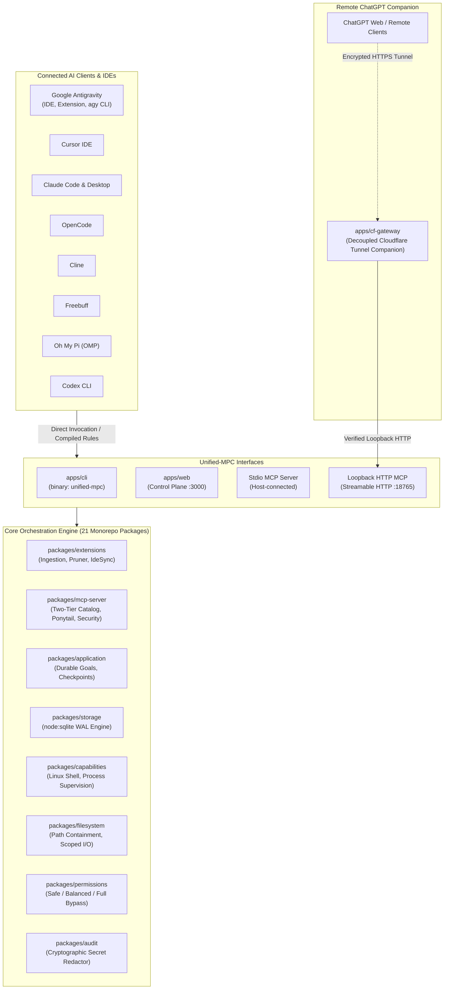

<h1 align="center">Unified-MPC-Server</h1>

<p align="center">
  <strong>Central Local-First MCP Orchestrator, Multi-Client Policy Synchronizer & Gated Remote Gateway</strong><br />
  <em>Universal tool discovery, bifurcated dynamic ingestion, zero-artifact pruning, and senior engineering harness across Google Antigravity, Cursor, Claude Code, Cline, OpenCode, Freebuff, Oh My Pi, and Codex CLI on Linux Ubuntu.</em>
</p>

<p align="center">
  <a href="LICENSE"></a>
  
  
  
  
  
</p>

---

## Overview

**Unified-MPC-Server** is an enterprise-grade, local-first Model Context Protocol (MCP) orchestrator and senior engineering harness designed natively for **Linux Ubuntu**. It serves as the single source of truth for tool routing, agent skills, execution policies, and IDE synchronization across the entire modern AI coding ecosystem.

By replacing fragmented configurations, fragile scripts, and disparate client rules with a centralized, high-performance engine, Unified-MPC-Server eliminates model confusion, prevents context window bloat, enforces software engineering discipline, and safely bridges local tools to cloud-based AI clients.



---

## Core System Capabilities

### 1. Universal Multi-Client IDE Hub & Policy Sync
- **Single Source of Truth**: Centrally manages tools, skills, and execution rules across **8 major AI developer environments**: Google Antigravity, Cursor, Claude Code / Desktop, Cline, OpenCode, Freebuff, Oh My Pi (OMP), and Codex CLI.
- **Atomic Block Injection**: Automatically compiles and injects system instructions into target rule files (`GEMINI.md`, `.cursor/rules/`, `CLAUDE.md`, `.clinerules`, `AGENTS.md`) using bounded markers (`<!-- MCP-POLICY-START -->` ... `<!-- MCP-POLICY-END -->`). All user-defined rules outside the markers remain untouched.
- **Zero Drift**: Ensures every AI client operating on your repository adheres to identical tool routing, workspace boundaries, and coding standards.

### 2. Dynamic User-Editable P1–Pn Runtime Policy
Prevents agent hallucination, erratic tool choices, and context window exhaustion with an ordered runtime policy that users can edit and reorder from the Web Control Plane. Semantic policy IDs remain stable while `P1`, `P2`, … `Pn` are derived execution positions, so moving a policy changes when it runs without changing its identity or breaking stored references.

The default policy order is:

| Position | Stable Policy ID | Resource / Server | Role & Execution Directive | Enforcement |
|---|---|---|---|---|
| **P1** | `session-start:ask-matt` | **`ask-matt`** | Load session-start engineering guidance before planning or acting on each user task. | **Mandatory (Every Session)** |
| **P2** | `child:memory` | **`memory`** | **Realtime Working Memory** with policy-declared required child tools such as `search_nodes`, `create_entities`, and `add_observations`. | **Mandatory (Realtime)** |
| **P3** | `pre-edit:thai-rag` | **`thai-rag-mcp`** | Local RAG and pre-edit context, including `pre_edit_context`, when repository context is relevant. | **Mandatory (Every Session)** |
| **P4** | `code-safety:godkiller` | **`godkiller`** | Code intelligence and blast-radius safety checks, including `gk_task`, before guarded code mutation. | **Mandatory (Pre-mutation)** |
| **P5** | `optional:sequentialthinking` | **`sequentialthinking`** | Revisable step-by-step reasoning for complex tasks. | On-Demand |
| **P6** | `optional:context7` | **`context7`** | Current version-specific library, framework, SDK, and API documentation. | On-Demand |
| **P7** | `optional:filesystem` | **`filesystem`** | Batch and cross-project filesystem operations. | On-Demand |
| **P8** | `optional:ui-skills` | **`ui-skills`** | UI/UX and frontend best-practice guidance. | On-Demand |

The Web Control Plane can add/remove policies, edit resource/type/mandatory/enforcement/required-tools/directive fields, and move any policy to a new P-position. `POST /api/policies` persists that ordered policy array; `policy_snapshot` exposes the live reconciled view; IDE policy sync compiles the same order into bounded rule blocks. Newly discovered non-mandatory MCP servers can also appear as runtime `AUTO_ROUTE` policies without flattening child tool schemas into the top-level catalog.

For every user task, the public `task_bootstrap` primitive resolves the live policy snapshot and session-start `ask-matt` skill in one server-side read. Optional child MCP tools remain lazy: policy-vetted read-only calls such as Context7 documentation lookups and Filesystem reads may execute through the parent without a host mutation prompt only when the supplied live descriptor/catalog fingerprints still match; unknown or mutating child calls keep the normal approval boundary.

### 3. Two-Tier Context Preservation Catalog
- **LLM Context Optimization**: Traditional MCP gateways flood the AI model's context window with dozens of massive tool schemas, inflating token costs and causing instruction distraction.
- **Dynamic Tiering**: Advertises high-frequency tier-1 tools by default, while lazily loading specialized toolsets and optional child MCP servers on demand. Mandatory workspace-harness children are pinned only after `workspace_bootstrap`; optional children connect for discovery/calls and may be released again when idle.
- **Completed-Turn Local RAG Persistence**: `record_turn` is a bounded parent-owned write fixed to `thai-rag-mcp/remember_turn`. HTTP/stdio transports share a bounded idempotency ledger so the same stable turn ID is not persisted twice when request-scoped registries are recreated. The parent first verifies the live child contract and refuses workspace-scoped Thai-RAG shadow definitions; generic mutating `mcp_call` remains separately guarded.

### 4. Bifurcated Dynamic Ingestion Engine
- **Strict Boundary Separation**: Eliminates polyglot configuration errors by enforcing a rigid architectural split between:
  - **Agent Skills**: Markdown instruction packages (`SKILL.md`) that guide agent behavior.
  - **MCP Servers**: Executable JSON-RPC / SSE / Streamable HTTP processes that provide executable tools.
- **Dedicated Workflows**: Separate validation pipelines and CLI subcommands (`unified-mpc install skill` vs `unified-mpc install server`), preventing corrupted server configs or misrouted skills.

### 5. Zero-Artifact Atomic Pruner
- **Graceful Process Termination**: Halts running server processes with orderly `SIGTERM` signalling followed by bounded escalation to `SIGKILL`.
- **Multi-IDE Config Cleanup**: Purges uninstalled server blocks and skill links from all registered IDE configuration files simultaneously.
- **Path Traversal Guards**: Verifies file boundaries before deletion (`isSafePurgePath`), cleaning up dangling symlinks, caches, and runtime data without risking system directories.

### 6. Durable Autonomous Goal Engine & Checkpoints
- **Native SQLite WAL Storage**: Powered by Node.js built-in `node:sqlite` in Write-Ahead Logging (WAL) mode—requiring zero external databases, native C++ compilation, or heavyweight daemons.
- **Goal Continuation**: Allows AI agents to execute complex, multi-turn goals autonomously across session boundaries with goal leases and fencing tokens.
- **Checkpoint State Machine**: Records point-in-time workspace snapshots and transaction journals, enabling safe rollbacks if an agent goes off course.
- **Task Supervisor**: Differentiates between `blocking_job` (tasks that affect execution liveness) and `supporting_service` (background daemons), preventing zombie processes.

### 7. Hard-Gated Cloudflare Gateway for ChatGPT Web
- **Outbound-Only Tunnel Companion**: Decoupled `apps/cf-gateway` companion establishes an outbound encrypted HTTPS tunnel via Cloudflare, eliminating the need to expose inbound ports on your host.
- **4-State Lifecycle Machine**: Coordinates transitions through `DISCONNECTED` $\to$ `TUNNEL_STARTING` $\to$ `BRIDGE_PROBING` $\to$ `BRIDGE_HEALTHY`.
- **Fail-Closed 412 Gate**: The gateway returns `412 Precondition Failed` if the local MCP endpoint fails its health probe, ensuring external AI clients (like ChatGPT Web) are never connected to a dead, stale, or misconfigured bridge.

### 8. Senior Engineering Harness (Ponytail + Runtime Workspace Harness)
- **Built-in Engineering Discipline**: Enforces the **Ponytail** development philosophy directly at the tool registry layer.
- **YAGNI & Minimalism**: Prompts agents to reach for standard libraries before external dependencies, write minimal diffs, and question unnecessary abstractions.
- **Fail-Closed Workspace Bootstrap**: Coding clients call `workspace_bootstrap` before their first source/config mutation. The runtime must read and SHA-256 fingerprint the registered workspace `AGENTS.md`; a missing or unreadable harness is a blocking error, not an empty-policy fallback.
- **Mandatory Native Child MCPs**: By default, `memory`, `thai-rag-mcp`, and `godkiller` are eagerly connected and pinned. Bootstrap verifies their exact required capabilities and fingerprints the child descriptor/catalog contracts. Workspace-scoped MCP definitions are never promoted into this trusted mandatory set.
- **Single-Use Pre-Edit Gate**: Every development-artifact path must pass `prepare_code_change` before mutation. The gate runs `thai-rag-mcp/pre_edit_context` and `godkiller/gk_task` with `action=edit_safe`; successful authorization is consumed after one successful mutation and must be refreshed before another edit.
- **Curated Working Memory**: ChatGPT/Web clients get stable first-party `working_memory_search` and `working_memory_record` tools rather than flattening the entire `memory` child server into the top-level MCP catalog.
- **Policy Drift Detection**: `AGENTS.md` is re-fingerprinted before pre-edit and code-mutation dispatch. Any change invalidates the session bootstrap and requires `workspace_bootstrap` again.
- **Bundled Skill Stability**: Ponytail runtime skills use the stable `bundled:agent-skills/*` namespace and resolve both from packaged resources and a source-checkout `.agents/skills` fallback.

### 9. Zero-Overhead Local Web Control Plane
- **Native HTTP Dashboard**: Zero-framework, ultra-fast Web Control Plane (`apps/web`) running at `http://127.0.0.1:3000/`.
- **Obsidian Telemetry**: Real-time monitoring cards for active bridges, Cloudflare tunnels, installed skills, mounted MCP servers, and connected IDEs.
- **Security by Default**: Enforces loopback `Host` and `Origin` validation, requires ownership tokens for pruning mutations, and enforces a strict 1 MiB body payload limit.

### 10. Unified Headless CLI (`unified-mpc`)
- **Developer & Agent Friendly**: Standalone executable CLI binary with deterministic POSIX exit codes (`0` for success, `1` for operational errors, `2` for syntax/argument errors).
- **Headless Automation**: Designed for seamless integration into CI pipelines, shell scripts, and terminal-based coding agents (Claude Code, OpenCode CLI, Agy CLI).

---

## Supported Clients & IDE Matrix

| Client / Environment | Supported Form Factors | Configuration Path | Skill Discovery Roots | Rule / Policy Sync Target |
|---|---|---|---|---|
| **Google Antigravity** | VS Code Extension, Antigravity IDE, `agy` CLI | `~/.gemini/config/mcp_config.json`<br>`<workspace>/.gemini/mcp.json` | `~/.gemini/config/skills/`<br>`<workspace>/.gemini/skills/` | `~/.gemini/config/GEMINI.md`<br>`<workspace>/GEMINI.md` |
| **Cursor** | Cursor IDE | `~/.cursor/mcp.json`<br>`<workspace>/.cursor/mcp.json` | `~/.cursor/skills/`<br>`<workspace>/.cursor/skills/` | `.cursor/rules/00-mandatory-policy.mdc` |
| **Claude** | Claude Desktop, Claude Code CLI | `~/.config/Claude/claude_desktop_config.json` | `~/.claude/skills/`<br>`<workspace>/.claude/skills/` | `~/.claude/CLAUDE.md`<br>`<workspace>/CLAUDE.md` |
| **Cline** | VS Code Extension, Cline CLI | `~/.config/Code/.../cline_mcp_settings.json`<br>`<workspace>/.cline/mcp.json` | `~/.cline/skills/`<br>`<workspace>/.cline/skills/` | `.clinerules`<br>`~/.cline/rules/` |
| **OpenCode** | CLI, VS Code Extension | `~/.config/opencode/opencode.jsonc`<br>`<workspace>/.opencode/mcp.json` | `~/.config/opencode/skill/`<br>`<workspace>/.opencode/skills/` | `AGENTS.md`<br>`~/.config/opencode/AGENTS.md` |
| **Freebuff** | Desktop Agent | Loopback HTTP or workspace state | `.agents/skills/`<br>`<workspace>/skills/` | `AGENTS.md` |
| **Oh My Pi (OMP)** | Terminal Agent CLI | `~/.omp/config.json` | `~/.omp/skills/`<br>`<workspace>/.omp/skills/` | `.omp/system.md` |
| **Codex CLI** | CLI Tool | Standard Codex Engine | `~/.codex/skills/`<br>`~/.codex/plugins/cache/` | `AGENTS.md` |

---

## Quickstart & Installation

### Requirements
- **Operating System**: Linux Ubuntu `>=22.04 LTS` (POSIX native)
- **Node.js**: `>=22.0.0` (with native `node:sqlite`)
- **Package Manager**: `pnpm >=10.0.0` (or via `corepack enable`)

### Setup

```bash
# 1. Clone repository
git clone https://github.com/soulzerox/Unified-MPC-Server.git
cd Unified-MPC-Server

# 2. Enable corepack and install dependencies
corepack enable
pnpm install

# 3. Build all 21 packages
pnpm build

# 4. Run system diagnostic
pnpm cli doctor
```

---

## CLI Reference (`unified-mpc`)

The binary can be invoked directly via `pnpm cli <command>` or linked globally as `unified-mpc`:

```bash
# Display system overview, configurations, and gateway status
unified-mpc status
unified-mpc status --json

# Run comprehensive system diagnostics and path permission checks
unified-mpc doctor

# Synchronize the current user-edited P1–Pn runtime policy and MCP server lists across all IDEs
unified-mpc sync
unified-mpc sync --targets antigravity,cursor,cline

# Install an Agent Skill (local folder or HTTPS Git repository)
unified-mpc install skill --name my-skill --source /path/to/skill-folder --targets all
unified-mpc install skill --name remote-skill --source https://github.com/example/remote-skill.git --targets cursor

# Install an executable MCP Server from an explicit command
unified-mpc install server --name sqlite-db \
  --transport stdio \
  --command npx \
  --args "-y mcp-server-sqlite --db /tmp/dev.db" \
  --targets antigravity,cursor

# Or register a self-contained/prebuilt MCP server from an HTTPS Git repository
unified-mpc install server --name remote-mcp \
  --transport stdio \
  --source https://github.com/example/remote-mcp.git \
  --targets cursor

# Atomically prune a Skill
unified-mpc prune skill --name my-skill

# Atomically prune an MCP Server (terminates process and purges IDE configs)
unified-mpc prune server --name sqlite-db

# Launch the Local Web Control Plane
unified-mpc web --port 3000

# Start the Streamable HTTP MCP runtime
UNIFIED_MPC_WORKSPACE=/path/to/workspace unified-mpc-mcp-http

# Direct tool inspection and execution
unified-mpc tools list
unified-mpc tools call memory__search_nodes '{"query": "capabilities"}'
```

---

## Local Web Control Plane & ChatGPT Web Pairing

The Local Web Control Plane runs at `http://127.0.0.1:3000/` and provides an intuitive management interface alongside the Streamable HTTP MCP endpoint at `http://127.0.0.1:18765/mcp`.

1. **Launch MCP HTTP**: `UNIFIED_MPC_WORKSPACE=/path/to/project unified-mpc-mcp-http` — the path must be the registered **project directory**, not a filesystem mount root.
2. **Launch Dashboard**: `unified-mpc web --port 3000`
3. **Open Dashboard**: Navigate to `http://127.0.0.1:3000/` in your browser.
4. **Configure the Cloudflare tunnel** (Gateway Configuration): enter Account ID, Zone Name (registrable domain, e.g. `example.com`), Tunnel Name, Public URL (HTTPS origin), Local MCP Origin (loopback **without a path** — Cloudflare ingress forwards the incoming request path unchanged, e.g. `http://127.0.0.1:18765`), API token, and the hostname/origin allowlists, then click **Validate, Configure & Start**. The system resolves or creates the named tunnel, configures ingress, upserts DNS, stores both tokens in the Linux Secret Service, starts `cloudflared`, and probes bridge health.
5. **Re-run without retyping**: non-secret settings persist as soon as you submit — even a failed attempt keeps the form prefilled. The API token is saved after the first successful configure; afterwards leave the token field blank to reuse the stored one (paste a new token only when rotating it).
6. **Connect ChatGPT**: once `BRIDGE_HEALTHY` is reached, copy the verified `mcpUrl` (e.g. `https://gpt-bridge.example.com/mcp`) into ChatGPT Web's custom connector (Settings → Apps & Connectors → enable Developer mode → Create, authentication: none).

> [!IMPORTANT]
> The gateway strictly enforces health invariants. Any attempt to connect while the bridge is non-operational returns `412 Precondition Failed`, protecting your remote session from silent disconnects.

### Keeping it running across reboots (systemd user services)

The checked-in systemd **user** units under `scripts/` run the two long-lived processes with explicit readiness ordering (enable `loginctl enable-linger $USER` so the user manager starts at boot without a login):

- `unified-mpc-mcp-http.service` — MCP HTTP on `127.0.0.1:18765`; startup waits for `/_unified-mpc/identity` to become healthy.
- `unified-mpc-web.service` — Web Control Plane on `127.0.0.1:3000`; `Requires/After` the MCP HTTP unit.
- `unified-mpc.service` — compatibility aggregate for starting/stopping both units together.

Copy `scripts/unified-mpc.service.env.example` to `~/.config/unified-mpc/service.env` and set absolute `UNIFIED_MPC_ROOT`, `UNIFIED_MPC_WORKSPACE`, and `PATH` values. The workspace must point at the **project directory**, not a filesystem mount root. Keep the real `~/.local/bin` path in `PATH` when `cloudflared` is installed there; add the exact nvm/asdf/mise Node `bin` directory when required.

Gateway intent also survives reboot. Successful Start/Reconcile persists `RUNNING` and the Web service automatically restores the bridge with retry/backoff, then auto-connects the ChatGPT Web session after `BRIDGE_HEALTHY`. Connected sessions are long-lived by default rather than expiring after a fixed lease TTL. While the gateway is intended to run, a health watchdog probes the public bridge every 10 seconds; 3 consecutive failures trigger tunnel replacement and automatic session restoration with capped exponential backoff plus jitter (1s base, 30s cap). Explicit Disconnect clears the session intent so recovery returns only to `BRIDGE_HEALTHY`; explicit Stop persists `STOPPED`, cancels watchdog/reconnect work, and remains stopped after restart. Legacy persisted tunnel settings with no desired-state key are recovered once and migrated to `RUNNING`; no post-reboot Start Gateway or Connect ChatGPT Web click is required for a gateway that was intentionally left running.

See [`docs/DEPLOYMENT_LINUX.md`](docs/DEPLOYMENT_LINUX.md) for installation, environment-file, readiness, and Secret Service details.

---

## Enterprise Security Guardrails

| Guardrail | Enforcement Point | Threat Mitigated |
|---|---|---|
| **Loopback Origin Policy** | `packages/mcp-server/` & `apps/web/` | Blocks DNS rebinding and cross-site HTTP requests (403 Forbidden). |
| **Fail-Closed Mutation Policy** | `packages/mcp-server/src/mutation-policy.ts` | Prevents unauthorized file writes, deletes, or command execution without explicit mode approval. |
| **Workspace Path Containment** | `packages/filesystem/` & `packages/extensions/` | Blocks path traversal (`../`) attacks outside authorized project workspace boundaries. |
| **Cryptographic Secret Redaction** | `packages/audit/src/redactor.ts` | Automatically sanitizes API tokens, private keys, and passwords from logs and activity journals. |
| **Self-Aggregation Block** | `packages/extensions/src/mcp-config-loader.ts` | Prevents infinite loops caused by Unified-MPC-Server discovering and invoking itself as a child. |
| **Workspace Harness & Mandatory Child Trust** | `packages/mcp-server/src/harness-runtime.ts` + `packages/extensions/src/extensions-service.ts` | Requires a readable `AGENTS.md`, fingerprints policy/child contracts, rejects workspace-scoped mandatory-child impersonation, and consumes per-path pre-edit authorization after each successful code mutation. |
| **Permission Profiles** | `packages/permissions/src/profiles.ts` | Enforces tiered capability access (`safe` default, `balanced`, and audited `full` bypass). |

---

## Monorepo Architecture

The repository contains 21 active workspace packages under the `@unified-mpc/*` namespace:

```text
Unified-MPC-Server/
├── apps/
│   ├── cli/                  # Native CLI entrypoint (binary: unified-mpc)
│   ├── web/                  # Local Web Control Plane (native node:http + Obsidian Telemetry)
│   └── cf-gateway/           # Decoupled Cloudflare Tunnel companion for ChatGPT Web
├── packages/
│   ├── extensions/           # Multi-Client Ingestion, Pruner, Config Loader, Skill Catalog, IDE Sync
│   ├── mcp-server/           # Core MCP server, Ponytail runtime, Two-Tier Catalog, Security policies
│   ├── application/          # Durable goal continuation, checkpoint service, agent swarm
│   ├── storage/              # SQLite database engine (node:sqlite WAL mode), transaction store
│   ├── capabilities/         # Linux process execution, shell task store, system probes, CDP
│   ├── filesystem/           # Scoped workspace I/O, path containment, patch applier
│   ├── process/              # Background process lifecycle, ring buffers, process supervision
│   ├── git/                  # Guarded Git mutations, diff fingerprinting, stash rollback
│   ├── permissions/          # Permission profiles (safe, balanced, full bypass)
│   ├── audit/                # Structured event logging with cryptographic secret redaction
│   ├── search/               # ripgrep integration, structural symbol searching
│   ├── workspace/            # Workspace boundary manager, secret detection
│   ├── project/              # Project type and toolchain detection
│   ├── codex/                # Codex CLI delegation adapter and discovery
│   ├── ipc-contracts/        # IPC message schemas and serialization
│   ├── shared/               # Shared constants, environment resolution, domain contracts
│   └── domain/               # Result<T, E>, AppError, domain entities, value objects
├── package.json
└── pnpm-workspace.yaml
```

---

## Authoritative Documentation

- [`SPEC.md`](SPEC.md): Master technical specification and behavioral invariants.
- [`CONTEXT.md`](CONTEXT.md): Living architectural context and domain glossary.
- [`docs/ARCHITECTURE.md`](docs/ARCHITECTURE.md): In-depth system architecture and package dependency graph.
- [`docs/USAGE_TH.md`](docs/USAGE_TH.md): Comprehensive user manual in Thai (คู่มือภาษาไทย).
- [`docs/MULTI_CLIENT_SYNC.md`](docs/MULTI_CLIENT_SYNC.md): Multi-client synchronization protocol and block injection details.
- [`docs/WEB_CONTROL_PLANE.md`](docs/WEB_CONTROL_PLANE.md): Web Control Plane architecture and API documentation.

---

## License

[MIT](LICENSE)
