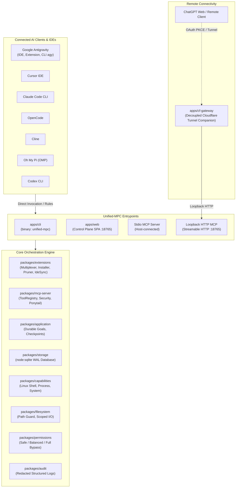

# Unified-MPC-Server Architecture

## 1. System Overview

**Unified-MPC-Server** is a unified, local-first engineering harness and Model Context Protocol (MCP) orchestrator designed specifically for **Linux Ubuntu** environments. It serves as the single source of truth for downstream tools, skills, security policies, and IDE synchronization across modern AI coding agents.

---

## 2. 100% Linux Ubuntu Native Target

Unified-MPC-Server is built from the ground up as a pure POSIX / Linux XDG-compliant service:
- **No Electron**: Desktop GUI dependencies have been eliminated in favor of a zero-overhead local Web Control Plane SPA (`apps/web`) and the native CLI binary (`apps/cli`).
- **No Windows / macOS Code**: Complete absence of PowerShell, Windows Sandbox, COM/Registry APIs, or macOS Swift bridges.
- **Node.js Native SQLite**: Leverages Node.js `>=22.0.0` built-in `node:sqlite` (`DatabaseSync`) in WAL mode, avoiding C++ native add-on compilation headaches.
- **XDG Base Directory Specification**:
  - Configuration & Data: `~/.local/share/unified-mpc/` (overridable via `UNIFIED_MPC_DATA_PATH`)
  - Runtime Database: `~/.local/share/unified-mpc/storage.sqlite`
  - Audit Logs: `~/.local/share/unified-mpc/audit.log`

---

## 3. Package Structure & Responsibilities

The monorepo contains 21 focused packages and applications:

| Category | Path | Package | Responsibility |
|---|---|---|---|
| **Applications** | `apps/cli` | `@unified-mpc/cli` | Standalone native CLI binary (`unified-mpc`) |
| | `apps/web` | `@unified-mpc/web` | Local Web Control Plane SPA & Fastify/HTTP server |
| | `apps/cf-gateway` | `@unified-mpc/cf-gateway` | Decoupled Cloudflare Tunnel & ChatGPT Web companion |
| **Extensions & Ingestion** | `packages/extensions` | `@unified-mpc/extensions` | Multi-client discovery, bifurcated installer, zero-artifact pruner, IDE policy sync |
| **MCP & Runtime** | `packages/mcp-server` | `@unified-mpc/mcp-server` | Core MCP server, two-tier catalog, security policies, Ponytail runtime |
| | `packages/capabilities` | `@unified-mpc/capabilities` | Linux process execution, shell task store, system probes, CDP |
| **Application & State** | `packages/application` | `@unified-mpc/application` | Durable goals, session continuation, checkpointing |
| | `packages/storage` | `@unified-mpc/storage` | SQLite database wrapper (WAL mode), repositories |
| | `packages/workspace` | `@unified-mpc/workspace` | Workspace registry, boundary guards, secret detection |
| **Infrastructure** | `packages/filesystem` | `@unified-mpc/filesystem` | Scoped filesystem operations, patch applier |
| | `packages/process` | `@unified-mpc/process` | Child process spawning, ring buffers, timeouts |
| | `packages/git` | `@unified-mpc/git` | Git status parsing, diff fingerprints, safe commits |
| | `packages/permissions`| `@unified-mpc/permissions`| Permission profiles (Safe, Balanced, Full Bypass) |
| | `packages/audit` | `@unified-mpc/audit` | Structured logging with cryptographic secret redaction |
| | `packages/search` | `@unified-mpc/search` | Fast ripgrep searching and symbol inspection |
| | `packages/shared` | `@unified-mpc/shared` | Shared contracts, constants, env resolution |
| | `packages/domain` | `@unified-mpc/domain` | `Result<T, E>`, `AppError`, value objects |
| | `packages/codex` | `@unified-mpc/codex` | Codex CLI delegation adapter and discovery |
| | `packages/project` | `@unified-mpc/project` | Project type and toolchain detection |
| | `packages/ipc-contracts`| `@unified-mpc/ipc-contracts`| IPC message type definitions |
| **Native Host** | `native/linux-host` | Rust crate | POSIX low-level process and terminal helper |

---

## 4. Security Boundaries & Guardrails

Unified-MPC-Server enforces strict defensive guardrails:

1. **Loopback-Only Origin Policy**:
   The Local Web Control Plane (`http://127.0.0.1:18765/`) and MCP HTTP endpoint strictly require loopback origins (`http://localhost:*` or `http://127.0.0.1:*`). Any foreign or non-HTTP origin receives an immediate `403 Forbidden`.
2. **Fail-Closed Mutation Policy**:
   Tools are categorized into `READ`, `WRITE`, `EXECUTE`, and `DANGEROUS`. Any unrecognized or unclassified tool call fails closed.
3. **Workspace Boundary Path Guards**:
   All filesystem reads, writes, and deletions are strictly resolved against registered workspace roots. Path traversal attacks (`../`) are intercepted and rejected with `PERMISSION_DENIED`.
4. **Secret Redaction**:
   Audit logs automatically redact API tokens (`sk-...`, `ghp_...`, Bearer tokens, private keys) before persisting them to disk.
5. **Double-Leasing Prevention**:
   Remote ChatGPT Web sessions require an explicit lease token and state transition gate (`BRIDGE_HEALTHY`), preventing conflicting workers from mutating the workspace simultaneously.

